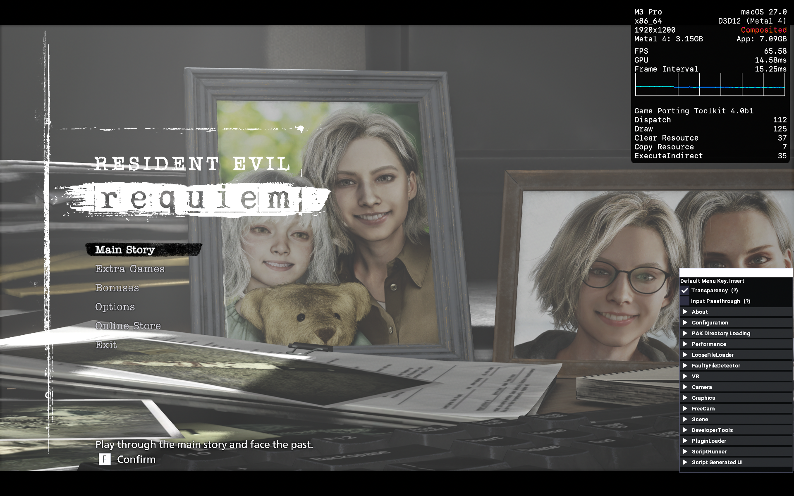

# REFramework — Wine / macOS (Apple GPTK / D3DMetal)  ⚠️ WIP

A fork of [praydog/REFramework](https://github.com/praydog/REFramework) adding a
Wine / Apple Game Porting Toolkit (D3DMetal) code path so RE Engine mods can load
on macOS. Work in progress. The Wine path is gated on `is_wine()`; the
Windows / Proton path is unchanged.

## Use

1. Get `dinput8.dll` — download from [Releases](../../releases), or build it (see Build).
2. Put `dinput8.dll` in the game folder, and make sure Wine is set to **override
   `dinput8` to native**, so the game loads this proxy DLL instead of the built-in one.
3. Install your mod per that mod's own instructions, then launch the game inside the
   CrossOver / GPTK bottle.

A release (and this code) may be out of date relative to upstream REFramework.

## Sample mod

A release also includes `re9-lmdf-test-mod.zip` — a small sample mod, used only to
sanity-check that the overlay loads (the project targets REFramework itself, not this
mod). It unlocks infinite ammo in Resident Evil Requiem's "Leon Must Die Forever"
minigame. Unzip it into the game folder so the script lands at
`reframework/autorun/re9_inf_ammo_lmdf.lua`, and keep DLSS frame generation enabled
at startup.

## Tested



- MacBook Pro 14" (M3 Pro)
- macOS Tahoe 27 beta 1
- CrossOver Preview 20260616 (27.0.0.40643)
- Apple GPTK 4 (D3DMetal 4.0 beta1)
- Resident Evil Requiem (Steam AppID 3764200, buildid 22898177)
- Tested at commit `43bd68a6470e7cb7e3dc630dd88be6a8a28c97d7` (this fork, branch `d3dmetal-wine-support`)

## Build

An x64 `dinput8.dll`. Build it in the cloud (GitHub Actions on a `windows-latest`
runner) or in a local Windows VM (same commands). A VM example:

### Local VM example (Apple Silicon)

A Windows 11 **ARM** guest, e.g. in VMware Fusion.

1. Install Git for Windows and **Visual Studio 2026 Community** with the
   **Desktop development with C++** and **.NET desktop development** workloads
   (the .NET one is required, or CMake configure fails).
2. In the VS developer command prompt:
   ```
   git clone --recursive -b d3dmetal-wine-support https://github.com/realyxl/REFramework.git
   cd REFramework
   cmake -S . -B build -G "Visual Studio 18 2026" -A x64 -DCMAKE_BUILD_TYPE=Release -DDEVELOPER_MODE=ON "-DCMAKE_POLICY_VERSION_MINIMUM=3.5"
   cmake --build build --config Release --target REFramework
   ```

Output: `build/bin/REFramework/dinput8.dll`.

## ⚠️ Known limitation — IMPORTANT

The overlay **requires DLSS frame generation to be enabled** while it loads at
startup; you can turn it off again afterwards.

## Credits

Based on praydog/REFramework; informed by the closed PR #1589.
